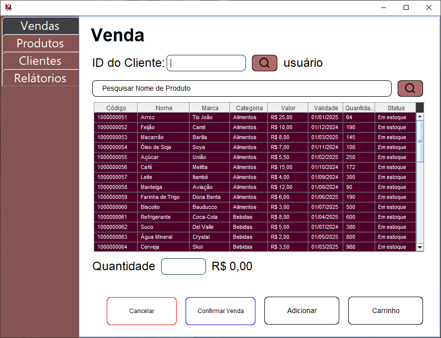

# Supermercado KR (PDV) 🛒

Olá, pessoal! 👋

É com grande entusiasmo e um profundo sentimento de realização que compartilho com vocês meu segundo Projeto Integrador (P.I.) no curso de **Tecnólogo de Análise e Desenvolvimento de Sistemas** do Centro Universitário Senac. Neste projeto, trabalhei em colaboração com meu colega de faculdade [@Rodrigo](https://github.com/RodrigoPereir4) para desenvolver um **Sistema de Ponto de Venda (PDV)** para um supermercado.

## Apresentação 📣
  
**Link do vídeo de demonstração:** [Clique aqui](https://www.linkedin.com/posts/kaique-parente-da-silva-82697b216_ol%C3%A1-pessoal-faz-um-tempo-que-n%C3%A3o-apare%C3%A7o-activity-7232903189199560705-urga?utm_source=share&utm_medium=member_desktop)

## Índice 📑

1. [Principais Aspectos Trabalhados 🔍](#principais-aspectos-trabalhados-)
   - [CRUD (Create, Read, Update, Delete)](#crud-create-read-update-delete)
   - [Java Swing](#java-swing)
   - [Banco de Dados MySQL](#banco-de-dados-mysql)
   - [Engenharia de Requisitos](#engenharia-de-requisitos)
   - [Diagrama de Casos de Uso e UML](#diagrama-de-casos-de-uso-e-uml)
2. [Experiência e Aprendizado 🌟](#experiencia-e-aprendizado-)
3. [Agradecimentos 🙏](#agradecimentos-)
4. [Licença :memo:](#memo-licença)

## Principais Aspectos Trabalhados 🔍

- **CRUD (Create, Read, Update, Delete)**: Implementação das funcionalidades essenciais para o gerenciamento de dados no sistema, garantindo operações eficientes e seguras. 🛠️

- **Java Swing**: Utilização desta biblioteca para construir a interface gráfica do usuário, criando um ambiente intuitivo e funcional para a operação do PDV. 🖥️

- **Banco de Dados MySQL**: Configuração e integração do banco de dados, incluindo modelagem conceitual e física, triggers, procedures e queries necessárias para o gerenciamento das informações. 🗃️

- **Engenharia de Requisitos**: Análise detalhada para definir os requisitos funcionais e não funcionais do sistema, assegurando que o produto final atendesse às necessidades dos usuários. 📋
- **Diagrama de Casos de Uso e UML**: Desenvolvimento de diagramas para mapear os casos de uso e modelar o sistema, facilitando a compreensão e o planejamento do desenvolvimento. 📈

## Experiência e Aprendizado 🌟

Esse projeto me proporcionou a oportunidade de aplicar e expandir meus conhecimentos em Java, além de explorar novos conceitos e ferramentas. A jornada foi desafiadora e exigiu uma combinação de aprendizado, planejamento, habilidades técnicas e pensamento crítico para resolver problemas e encontrar soluções eficazes.

Transformar uma ideia do papel em um projeto funcional e bem-sucedido foi extremamente gratificante. Estou empolgado para continuar aprimorando minhas habilidades e em busca de novas oportunidades no mercado de TI. 🚀

## Agradecimentos 🙏

Agradeço a todos que acompanharam minha trajetória até aqui estou ansioso para compartilhar mais sobre outros projetos e continuar explorando novas possibilidades!

Obrigado pelo apoio e até a próxima! 👋🚀

## :memo: Licença

Este projeto está licenciado sob a [MIT License](https://github.com/Kaique-Parente/Supermercado/blob/main/LICENSE). 📜
